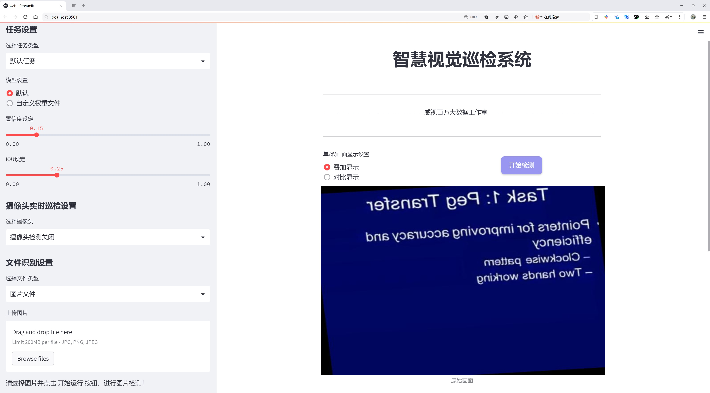
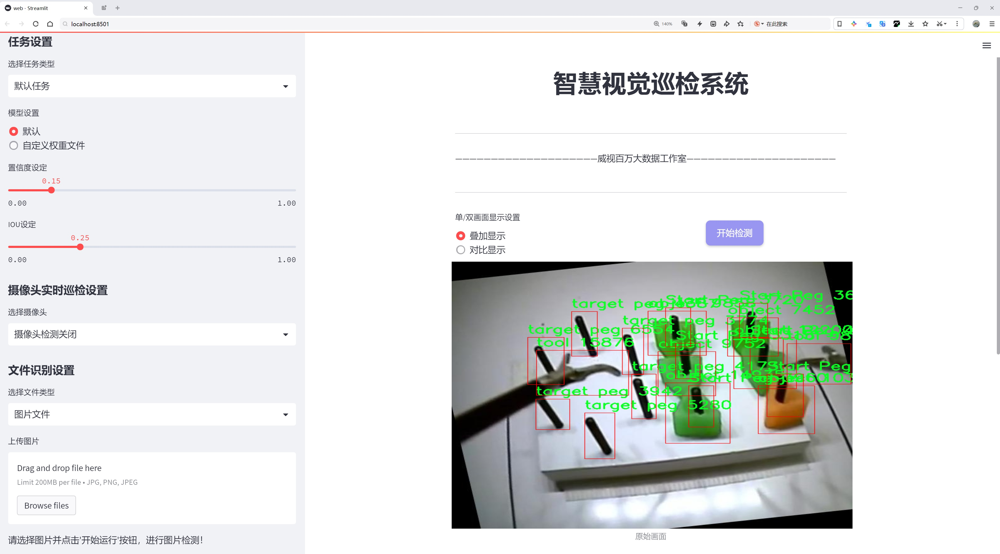
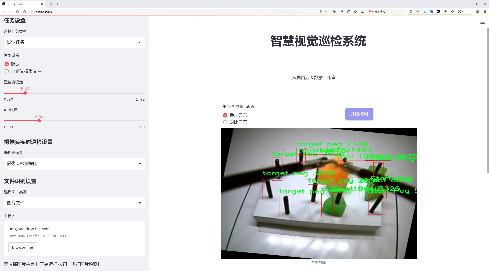
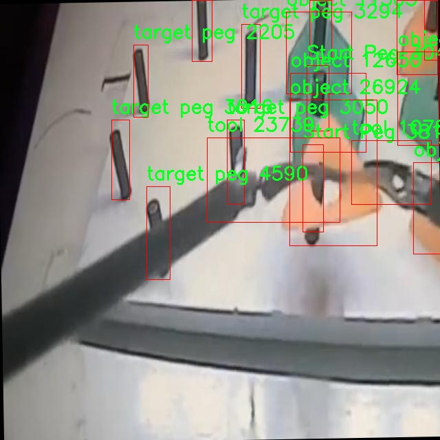
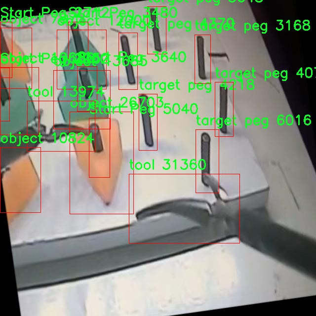
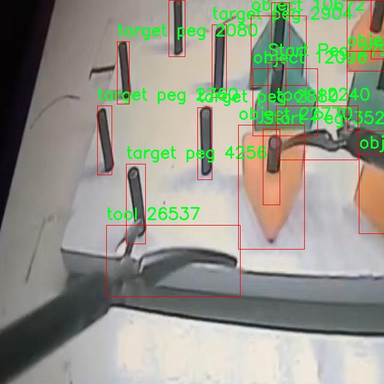
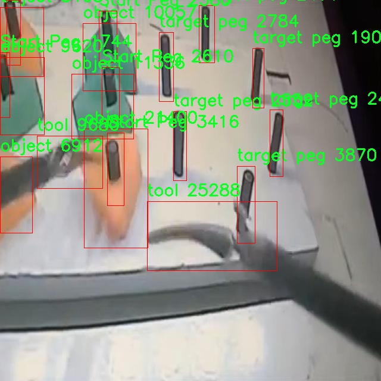
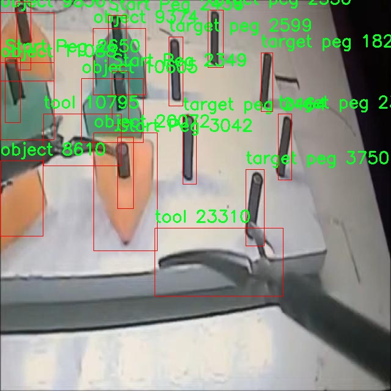

# 腹腔镜工具识别与定位检测系统源码分享
 # [一条龙教学YOLOV8标注好的数据集一键训练_70+全套改进创新点发刊_Web前端展示]

### 1.研究背景与意义

项目参考[AAAI Association for the Advancement of Artificial Intelligence](https://gitee.com/qunshansj/projects)

项目来源[AACV Association for the Advancement of Computer Vision](https://gitee.com/qunmasj/projects)

研究背景与意义

随着微创手术技术的迅速发展，腹腔镜手术因其创伤小、恢复快等优点，逐渐成为外科手术的重要选择。然而，腹腔镜手术的复杂性和对外科医生技能的高要求，使得手术过程中的工具识别与定位成为一项重要的研究课题。传统的手术工具识别方法往往依赖于医生的经验和视觉判断，容易受到手术环境、光照变化及工具种类多样性的影响，导致识别精度低、效率差。因此，开发一种高效、准确的腹腔镜工具识别与定位系统显得尤为重要。

近年来，深度学习技术的迅猛发展为计算机视觉领域带来了革命性的变化，尤其是在目标检测方面。YOLO（You Only Look Once）系列模型以其高效的实时检测能力和良好的准确性，成为了目标检测领域的热门选择。YOLOv8作为该系列的最新版本，进一步提升了模型的性能和适用性，为腹腔镜工具的自动识别提供了新的可能性。通过对YOLOv8模型的改进，可以更好地适应腹腔镜手术中的特殊场景，提升工具识别的准确性和实时性。

本研究基于改进YOLOv8模型，旨在构建一个高效的腹腔镜工具识别与定位系统。研究所使用的数据集包含7000张图像，涵盖了四类工具：起始钉、目标钉、物体和工具。这些数据不仅丰富了模型的训练样本，也为后续的算法优化提供了基础。通过对这些数据的深入分析和处理，可以有效提升模型在不同手术场景下的识别能力。

本研究的意义在于，首先，通过改进YOLOv8模型，能够实现对腹腔镜手术中工具的快速、准确识别，减少外科医生在手术过程中的负担，提高手术效率。其次，基于深度学习的工具识别系统将为手术机器人和智能手术辅助系统的开发奠定基础，推动智能医疗技术的发展。此外，研究成果还可以为其他类型的手术工具识别提供借鉴，具有广泛的应用前景。

综上所述，基于改进YOLOv8的腹腔镜工具识别与定位系统的研究，不仅具有重要的理论价值，还有助于推动实际临床应用的进步，提升腹腔镜手术的安全性和有效性，为未来的智能医疗发展贡献力量。通过本研究，期望能够为腹腔镜手术的自动化和智能化提供新的思路和解决方案，推动外科手术向更高效、更安全的方向发展。

### 2.图片演示







##### 注意：由于此博客编辑较早，上面“2.图片演示”和“3.视频演示”展示的系统图片或者视频可能为老版本，新版本在老版本的基础上升级如下：（实际效果以升级的新版本为准）

  （1）适配了YOLOV8的“目标检测”模型和“实例分割”模型，通过加载相应的权重（.pt）文件即可自适应加载模型。

  （2）支持“图片识别”、“视频识别”、“摄像头实时识别”三种识别模式。

  （3）支持“图片识别”、“视频识别”、“摄像头实时识别”三种识别结果保存导出，解决手动导出（容易卡顿出现爆内存）存在的问题，识别完自动保存结果并导出到tempDir中。

  （4）支持Web前端系统中的标题、背景图等自定义修改，后面提供修改教程。

  另外本项目提供训练的数据集和训练教程,暂不提供权重文件（best.pt）,需要您按照教程进行训练后实现图片演示和Web前端界面演示的效果。

### 3.视频演示

[3.1 视频演示](https://www.bilibili.com/video/BV1QHtJeqEaF/)

### 4.数据集信息展示

##### 4.1 本项目数据集详细数据（类别数＆类别名）

nc: 4
names: ['Start Peg', 'object', 'target peg', 'tool']


##### 4.2 本项目数据集信息介绍

数据集信息展示

在本研究中，我们采用了名为“Laparoscopic Peg Transfer”的数据集，以改进YOLOv8模型在腹腔镜工具识别与定位系统中的性能。该数据集专门设计用于腹腔镜手术场景，涵盖了手术过程中涉及的多种关键元素，旨在为机器学习模型提供丰富的训练数据，以提升其在实际应用中的准确性和可靠性。

“Laparoscopic Peg Transfer”数据集包含四个主要类别，分别是“Start Peg”、“object”、“target peg”和“tool”。这些类别的选择基于腹腔镜手术的实际需求，涵盖了手术中最常见的物体和工具。首先，“Start Peg”代表了手术开始时所需的初始定位标志，它是手术成功的关键参考点之一。其次，“object”类别则泛指手术中可能出现的各种物体，这些物体可能会影响手术的顺利进行，因此需要被准确识别和定位。接下来，“target peg”是手术过程中需要达到的目标标志，通常用于指导外科医生在操作过程中进行精确的定位和转移。最后，“tool”类别则包括了所有用于手术的工具，这些工具的识别和定位对于手术的安全性和有效性至关重要。

该数据集的构建过程充分考虑了腹腔镜手术的复杂性和多样性，确保了数据的多样性和代表性。数据集中包含了大量的图像和标注信息，涵盖了不同的手术场景、角度和光照条件。这种多样性不仅增强了模型的泛化能力，还提高了其在不同手术环境下的适应性。此外，数据集中的标注信息经过严格审核，确保每个类别的标注准确无误，从而为模型的训练提供了高质量的基础。

在使用“Laparoscopic Peg Transfer”数据集进行YOLOv8模型的训练时，我们将重点关注模型在不同类别上的识别精度和定位准确性。通过对数据集的深入分析和训练，我们期望能够显著提升模型在腹腔镜手术中的应用效果，使其能够实时、准确地识别和定位手术工具和目标物体。这不仅有助于提高手术的安全性和效率，也为未来的智能手术系统奠定了坚实的基础。

综上所述，“Laparoscopic Peg Transfer”数据集为改进YOLOv8模型提供了一个极具价值的训练资源。通过对该数据集的充分利用，我们期望能够在腹腔镜工具识别与定位领域取得突破性进展，为外科手术的智能化发展贡献力量。











### 5.全套项目环境部署视频教程（零基础手把手教学）

[5.1 环境部署教程链接（零基础手把手教学）](https://www.ixigua.com/7404473917358506534?logTag=c807d0cbc21c0ef59de5)


[5.2 安装Python虚拟环境创建和依赖库安装视频教程链接（零基础手把手教学）](https://www.ixigua.com/7404474678003106304?logTag=1f1041108cd1f708b01a)

### 6.手把手YOLOV8训练视频教程（零基础小白有手就能学会）

[6.1 手把手YOLOV8训练视频教程（零基础小白有手就能学会）](https://www.ixigua.com/7404477157818401292?logTag=d31a2dfd1983c9668658)

### 7.70+种全套YOLOV8创新点代码加载调参视频教程（一键加载写好的改进模型的配置文件）

[7.1 70+种全套YOLOV8创新点代码加载调参视频教程（一键加载写好的改进模型的配置文件）](https://www.ixigua.com/7404478314661806627?logTag=29066f8288e3f4eea3a4)

### 8.70+种全套YOLOV8创新点原理讲解（非科班也可以轻松写刊发刊，V10版本正在科研待更新）

由于篇幅限制，每个创新点的具体原理讲解就不一一展开，具体见下列网址中的创新点对应子项目的技术原理博客网址【Blog】：


[8.1 70+种全套YOLOV8创新点原理讲解链接](https://gitee.com/qunmasj/good)

### 9.系统功能展示（检测对象为举例，实际内容以本项目数据集为准）

图9.1.系统支持检测结果表格显示

  图9.2.系统支持置信度和IOU阈值手动调节

  图9.3.系统支持自定义加载权重文件best.pt(需要你通过步骤5中训练获得)

  图9.4.系统支持摄像头实时识别

  图9.5.系统支持图片识别

  图9.6.系统支持视频识别

  图9.7.系统支持识别结果文件自动保存

  图9.8.系统支持Excel导出检测结果数据


### 10.原始YOLOV8算法原理

原始YOLOv8算法原理

YOLOv8是计算机视觉领域中一种革命性的目标检测模型，标志着YOLO系列的最新进展。它在2023年1月发布，基于前几代YOLO模型的成功经验，结合了多种先进的技术，力求在目标检测的准确性和速度上达到新的高度。YOLOv8的设计理念不仅仅是对YOLOv5的简单改进，而是通过全新的网络结构和检测机制，形成了一种更为高效的目标检测解决方案。

YOLOv8的网络结构主要由三部分组成：Backbone、Neck和Head。Backbone负责特征提取，Neck用于特征融合，而Head则是最终的目标检测输出。YOLOv8的Backbone采用了CSPDarknet结构，这是一种跨阶段局部网络，旨在提高特征提取的效率和效果。CSPDarknet将输入特征图分为两个分支，每个分支都经过多个残差块的处理，这种设计不仅增加了网络的深度，还有效地提升了特征的表达能力。相较于YOLOv5，YOLOv8引入了C2f模块替代了C3模块。C2f模块的创新在于其将特征图分为两个分支，经过卷积层降维后再进行融合，这样的设计允许模型在更高维度的特征空间中进行学习，进而提升了梯度流的有效性。

在特征提取的过程中，YOLOv8还采用了快速空间金字塔池化（SPPF）结构。这一结构的引入，使得模型能够有效提取不同尺度的特征，极大地减少了参数量和计算量，同时提高了特征提取的效率。SPPF通过在不同的空间尺度上进行池化操作，增强了模型对多尺度目标的适应能力，使得YOLOv8在处理复杂场景时表现得更加出色。

在Neck部分，YOLOv8采用了特征金字塔网络（FPN）和路径聚合网络（PAN）的结合。这一结构通过多个卷积层和池化层对特征图进行处理和压缩，确保了不同层次特征的有效融合。FPN和PAN的结合使得YOLOv8能够在多尺度特征的基础上，生成更加精确的目标检测结果，提升了模型在复杂场景下的表现。

YOLOv8的Head部分则是其最具创新性的地方。与之前的YOLO版本不同，YOLOv8采用了无锚框（Anchor-Free）的检测方式。这种方法直接预测目标的中心点和宽高比，避免了传统Anchor框的设计，使得模型在检测速度和准确度上都有了显著提升。通过解耦的分类和回归分支，YOLOv8能够更加灵活地处理不同类型的目标，进一步提高了检测的精度。

值得一提的是，YOLOv8在损失函数的设计上也进行了创新，采用了CloU损失函数。这一损失函数的引入，使得模型在训练过程中能够更好地处理目标的定位和分类任务，提升了整体的检测性能。

YOLOv8的另一个重要特点是其在不同硬件平台上的适应性。无论是在CPU还是GPU上，YOLOv8都能够高效运行，确保了其在实际应用中的广泛适用性。这一特性使得YOLOv8不仅适用于学术研究，也能够在工业界和商业应用中发挥重要作用。

总的来说，YOLOv8通过引入新的网络结构、优化特征提取和检测机制、创新损失函数等多方面的改进，极大地提升了目标检测的性能。它不仅在准确性和速度上超越了前代模型，还在小目标检测和高分辨率图像处理方面表现出色。这些特性使得YOLOv8成为当前计算机视觉领域中最先进的目标检测模型之一，推动了目标检测技术的进一步发展。随着YOLOv8的广泛应用，我们可以期待在更多实际场景中，看到其带来的变革与创新。


### 11.项目核心源码讲解（再也不用担心看不懂代码逻辑）

#### 11.1 code\ultralytics\models\fastsam\predict.py

以下是对给定代码的核心部分进行分析和详细注释的结果：

```python
# 导入必要的库
import torch
from ultralytics.engine.results import Results
from ultralytics.models.fastsam.utils import bbox_iou
from ultralytics.models.yolo.detect.predict import DetectionPredictor
from ultralytics.utils import DEFAULT_CFG, ops

class FastSAMPredictor(DetectionPredictor):
    """
    FastSAMPredictor 类专门用于在 Ultralytics YOLO 框架中进行快速 SAM（Segment Anything Model）分割预测任务。

    该类扩展了 DetectionPredictor，定制了预测管道，特别针对快速 SAM 进行了调整。
    它优化了后处理步骤，以结合掩码预测和非最大抑制，同时优化单类分割。
    """

    def __init__(self, cfg=DEFAULT_CFG, overrides=None, _callbacks=None):
        """
        初始化 FastSAMPredictor 类，继承自 DetectionPredictor，并将任务设置为 'segment'。

        参数:
            cfg (dict): 预测的配置参数。
            overrides (dict, optional): 可选的参数覆盖，用于自定义行为。
            _callbacks (dict, optional): 可选的回调函数列表，在预测过程中调用。
        """
        super().__init__(cfg, overrides, _callbacks)  # 调用父类构造函数
        self.args.task = "segment"  # 设置任务为分割

    def postprocess(self, preds, img, orig_imgs):
        """
        对预测结果进行后处理，包括非最大抑制和将框缩放到原始图像大小，并返回最终结果。

        参数:
            preds (list): 模型的原始输出预测。
            img (torch.Tensor): 处理后的图像张量。
            orig_imgs (list | torch.Tensor): 原始图像或图像列表。

        返回:
            (list): 包含处理后的框、掩码和其他元数据的 Results 对象列表。
        """
        # 应用非最大抑制以过滤预测框
        p = ops.non_max_suppression(
            preds[0],
            self.args.conf,  # 置信度阈值
            self.args.iou,  # IOU 阈值
            agnostic=self.args.agnostic_nms,  # 是否对类别不敏感
            max_det=self.args.max_det,  # 最大检测数量
            nc=1,  # 设置为 1 类，因为 SAM 没有类别预测
            classes=self.args.classes,  # 指定的类别
        )

        # 创建一个全框以进行 IOU 计算
        full_box = torch.zeros(p[0].shape[1], device=p[0].device)
        full_box[2], full_box[3], full_box[4], full_box[6:] = img.shape[3], img.shape[2], 1.0, 1.0
        full_box = full_box.view(1, -1)  # 调整形状

        # 计算 IOU 并更新 full_box
        critical_iou_index = bbox_iou(full_box[0][:4], p[0][:, :4], iou_thres=0.9, image_shape=img.shape[2:])
        if critical_iou_index.numel() != 0:
            full_box[0][4] = p[0][critical_iou_index][:, 4]  # 更新置信度
            full_box[0][6:] = p[0][critical_iou_index][:, 6:]  # 更新其他信息
            p[0][critical_iou_index] = full_box  # 替换预测框

        # 确保原始图像是一个 numpy 数组
        if not isinstance(orig_imgs, list):
            orig_imgs = ops.convert_torch2numpy_batch(orig_imgs)

        results = []  # 存储结果
        proto = preds[1][-1] if len(preds[1]) == 3 else preds[1]  # 获取掩码原型

        # 遍历每个预测结果
        for i, pred in enumerate(p):
            orig_img = orig_imgs[i]  # 获取原始图像
            img_path = self.batch[0][i]  # 获取图像路径

            if not len(pred):  # 如果没有预测框
                masks = None  # 掩码为 None
            elif self.args.retina_masks:  # 如果使用 Retina 掩码
                pred[:, :4] = ops.scale_boxes(img.shape[2:], pred[:, :4], orig_img.shape)  # 缩放框
                masks = ops.process_mask_native(proto[i], pred[:, 6:], pred[:, :4], orig_img.shape[:2])  # 处理掩码
            else:  # 否则使用常规掩码处理
                masks = ops.process_mask(proto[i], pred[:, 6:], pred[:, :4], img.shape[2:], upsample=True)  # 处理掩码
                pred[:, :4] = ops.scale_boxes(img.shape[2:], pred[:, :4], orig_img.shape)  # 缩放框

            # 将结果存储到 Results 对象中
            results.append(Results(orig_img, path=img_path, names=self.model.names, boxes=pred[:, :6], masks=masks))

        return results  # 返回处理后的结果
```

### 代码核心部分说明：
1. **类定义**：`FastSAMPredictor` 继承自 `DetectionPredictor`，专门用于快速分割任务。
2. **初始化方法**：设置任务为分割，并调用父类的初始化方法。
3. **后处理方法**：对模型的原始预测结果进行后处理，包括非最大抑制、框的缩放和掩码的处理，最终返回包含结果的列表。

该文件定义了一个名为 `FastSAMPredictor` 的类，专门用于在 Ultralytics YOLO 框架中执行快速的 SAM（Segment Anything Model）分割预测任务。该类继承自 `DetectionPredictor`，并对预测流程进行了定制，以适应快速 SAM 的需求。

在初始化方法 `__init__` 中，调用了父类的构造函数，并将任务类型设置为“segment”，表明该预测器将用于分割任务。该类的构造函数接受三个参数：配置参数 `cfg`、可选的参数覆盖 `overrides` 和可选的回调函数 `_callbacks`。

`postprocess` 方法负责对模型的原始输出进行后处理，包括非极大值抑制（NMS）和将边界框缩放到原始图像大小。该方法接受三个参数：模型的原始预测 `preds`、处理后的图像张量 `img` 和原始图像（或图像列表） `orig_imgs`。首先，使用非极大值抑制来过滤预测结果，保留置信度高的边界框。接着，创建一个全框 `full_box`，并根据图像的尺寸进行初始化。

接下来，计算与全框的 IOU（Intersection over Union），并根据设定的阈值（0.9）来更新 `full_box` 的值。之后，如果输入的原始图像不是列表，则将其转换为 NumPy 格式。然后，遍历每个预测结果，处理边界框和掩码。根据设置的参数，选择不同的方式来处理掩码，并将处理后的结果封装到 `Results` 对象中，最终返回包含所有结果的列表。

总体而言，该文件实现了一个高效的分割预测流程，利用了 YOLO 框架的优势，并针对 SAM 模型的特点进行了优化，确保能够快速且准确地处理分割任务。

#### 11.2 70+种YOLOv8算法改进源码大全和调试加载训练教程（非必要）\ultralytics\models\yolo\detect\val.py

以下是经过简化并注释的代码，保留了最核心的部分：

```python
import os
import torch
from ultralytics.engine.validator import BaseValidator
from ultralytics.utils import LOGGER, ops
from ultralytics.utils.metrics import DetMetrics, box_iou
from ultralytics.utils.plotting import output_to_target, plot_images

class DetectionValidator(BaseValidator):
    """
    继承自BaseValidator类，用于基于检测模型的验证。
    """

    def __init__(self, dataloader=None, save_dir=None, args=None):
        """初始化检测模型所需的变量和设置。"""
        super().__init__(dataloader, save_dir, args)
        self.metrics = DetMetrics(save_dir=self.save_dir)  # 初始化检测指标
        self.iouv = torch.linspace(0.5, 0.95, 10)  # IoU向量，用于计算mAP@0.5:0.95

    def preprocess(self, batch):
        """对YOLO训练的图像批次进行预处理。"""
        # 将图像数据转移到设备上，并进行归一化处理
        batch['img'] = batch['img'].to(self.device, non_blocking=True) / 255
        # 将其他数据转移到设备上
        for k in ['batch_idx', 'cls', 'bboxes']:
            batch[k] = batch[k].to(self.device)
        return batch

    def postprocess(self, preds):
        """对预测输出应用非极大值抑制（NMS）。"""
        return ops.non_max_suppression(preds, self.args.conf, self.args.iou)

    def update_metrics(self, preds, batch):
        """更新检测指标。"""
        for si, pred in enumerate(preds):
            idx = batch['batch_idx'] == si
            cls = batch['cls'][idx]
            bbox = batch['bboxes'][idx]
            npr = pred.shape[0]  # 预测框的数量

            if npr == 0:
                continue  # 如果没有预测框，跳过

            # 处理预测框
            predn = pred.clone()
            ops.scale_boxes(batch['img'][si].shape[1:], predn[:, :4], batch['ori_shape'][si])  # 将预测框缩放到原始图像大小

            # 计算IoU并更新指标
            if cls.shape[0] > 0:
                correct_bboxes = self._process_batch(predn, torch.cat((cls, bbox), 1))
            self.metrics.process(predn, cls)  # 更新指标

    def _process_batch(self, detections, labels):
        """返回正确的预测矩阵。"""
        iou = box_iou(labels[:, 1:], detections[:, :4])  # 计算IoU
        return self.match_predictions(detections[:, 5], labels[:, 0], iou)  # 匹配预测与标签

    def print_results(self):
        """打印每个类别的训练/验证集指标。"""
        LOGGER.info(f'总计: {self.metrics.mean_results()}')  # 打印平均结果

    def plot_predictions(self, batch, preds, ni):
        """在输入图像上绘制预测的边界框并保存结果。"""
        plot_images(batch['img'], *output_to_target(preds), paths=batch['im_file'], fname=self.save_dir / f'val_batch{ni}_pred.jpg')

```

### 代码注释说明：
1. **DetectionValidator类**：这个类用于验证YOLO模型的检测性能，继承自`BaseValidator`。
2. **__init__方法**：初始化检测指标和IoU向量。
3. **preprocess方法**：对输入的图像批次进行预处理，包括将图像归一化和将数据转移到指定设备。
4. **postprocess方法**：对模型的预测结果应用非极大值抑制，以去除冗余的检测框。
5. **update_metrics方法**：更新检测指标，计算每个预测框的IoU，并将结果与真实标签进行比较。
6. **_process_batch方法**：计算IoU并返回正确的预测矩阵。
7. **print_results方法**：打印模型在验证集上的平均检测结果。
8. **plot_predictions方法**：将预测的边界框绘制在输入图像上并保存结果。 

这些注释帮助理解每个方法的功能和目的，便于后续的维护和扩展。

这个程序文件是一个用于YOLOv8目标检测模型验证的实现，主要包含了数据预处理、模型评估、结果输出等功能。文件中定义了一个名为`DetectionValidator`的类，该类继承自`BaseValidator`，用于对YOLO模型进行验证。

在初始化方法中，类的构造函数设置了一些必要的变量和参数，包括数据加载器、保存目录、进度条、参数字典等。它还初始化了一些评估指标，如检测指标和混淆矩阵，并设置了任务类型为检测。

`preprocess`方法负责对输入的图像批次进行预处理，包括将图像转换为适合模型输入的格式，并将标签和边界框数据移动到相应的设备上（如GPU）。如果启用了混合保存模式，还会进行自标签的准备。

`init_metrics`方法用于初始化评估指标，判断数据集是否为COCO格式，并根据模型的类别名称设置相关参数。

`postprocess`方法应用非极大值抑制（NMS）来处理模型的预测输出，以减少冗余的边界框。

`update_metrics`方法用于更新评估指标，计算每个批次的预测结果与真实标签之间的匹配情况，并记录相关的统计信息。

`finalize_metrics`方法用于设置最终的指标值，包括速度和混淆矩阵。

`get_stats`方法返回当前的评估统计信息和结果字典。

`print_results`方法用于打印每个类别的训练/验证集指标，包括每个类别的图像数量、实例数量和各项指标的平均值。

`_process_batch`方法用于处理每个批次的检测结果，计算IoU（交并比）并返回正确的预测矩阵。

`build_dataset`和`get_dataloader`方法用于构建YOLO数据集和返回数据加载器，以便在验证过程中使用。

`plot_val_samples`和`plot_predictions`方法用于可视化验证图像样本和预测结果，并将结果保存为图像文件。

`save_one_txt`和`pred_to_json`方法用于将YOLO检测结果保存为文本文件和COCO格式的JSON文件。

最后，`eval_json`方法用于评估YOLO输出的JSON格式结果，并返回性能统计信息，特别是针对COCO数据集的mAP（平均精度）评估。

整体而言，这个文件实现了YOLOv8模型在验证阶段的各项功能，确保模型的性能可以通过各种指标进行评估和可视化。

#### 11.3 ui.py

```python
import sys
import subprocess

def run_script(script_path):
    """
    使用当前 Python 环境运行指定的脚本。

    Args:
        script_path (str): 要运行的脚本路径

    Returns:
        None
    """
    # 获取当前 Python 解释器的路径
    python_path = sys.executable

    # 构建运行命令
    command = f'"{python_path}" -m streamlit run "{script_path}"'

    # 执行命令
    result = subprocess.run(command, shell=True)
    if result.returncode != 0:
        print("脚本运行出错。")


# 实例化并运行应用
if __name__ == "__main__":
    # 指定您的脚本路径
    script_path = "web.py"  # 这里可以直接指定脚本路径

    # 运行脚本
    run_script(script_path)
```

### 代码注释说明：

1. **导入模块**：
   - `import sys`：导入 `sys` 模块，用于访问与 Python 解释器相关的变量和函数。
   - `import subprocess`：导入 `subprocess` 模块，用于创建新进程、连接到它们的输入/输出/错误管道，并获取返回码。

2. **定义 `run_script` 函数**：
   - 该函数接收一个参数 `script_path`，表示要运行的 Python 脚本的路径。
   - 使用 `sys.executable` 获取当前 Python 解释器的路径，以确保使用正确的 Python 环境来运行脚本。
   - 构建一个命令字符串，使用 `streamlit` 模块运行指定的脚本。
   - 使用 `subprocess.run` 执行构建的命令，并检查返回码以判断脚本是否成功运行。

3. **主程序入口**：
   - 使用 `if __name__ == "__main__":` 确保只有在直接运行该脚本时才会执行以下代码。
   - 指定要运行的脚本路径（这里为 `"web.py"`）。
   - 调用 `run_script` 函数来执行指定的脚本。

这个程序文件名为 `ui.py`，主要功能是使用当前的 Python 环境来运行一个指定的脚本，具体是通过 Streamlit 来启动一个 Web 应用。

首先，程序导入了几个必要的模块，包括 `sys`、`os` 和 `subprocess`。`sys` 模块用于访问与 Python 解释器相关的变量和函数，`os` 模块提供了与操作系统交互的功能，而 `subprocess` 模块则用于创建新进程、连接到它们的输入/输出/错误管道，并获取它们的返回码。

接下来，程序从 `QtFusion.path` 模块中导入了 `abs_path` 函数，这个函数的作用是获取给定路径的绝对路径。

在 `run_script` 函数中，程序接收一个参数 `script_path`，表示要运行的脚本的路径。函数首先获取当前 Python 解释器的路径，并将其存储在 `python_path` 变量中。然后，程序构建一个命令字符串，使用 Streamlit 运行指定的脚本。这个命令字符串的格式是 `"{python_path}" -m streamlit run "{script_path}"`，其中 `{python_path}` 和 `{script_path}` 会被实际的路径替换。

接下来，程序使用 `subprocess.run` 方法执行这个命令。如果命令执行的返回码不为 0，表示脚本运行出错，程序会打印出“脚本运行出错。”的提示信息。

在文件的最后部分，程序通过 `if __name__ == "__main__":` 语句来判断是否是直接运行该脚本。如果是，程序会指定要运行的脚本路径，这里是通过 `abs_path("web.py")` 获取的 `web.py` 的绝对路径。然后，调用 `run_script` 函数来执行这个脚本。

总的来说，这个程序的主要作用是方便地启动一个基于 Streamlit 的 Web 应用，用户只需指定脚本路径，程序就会自动处理执行的细节。

#### 11.4 train.py

以下是代码中最核心的部分，并附上详细的中文注释：

```python
class DetectionTrainer(BaseTrainer):
    """
    DetectionTrainer类，继承自BaseTrainer类，用于基于检测模型的训练。
    """

    def build_dataset(self, img_path, mode="train", batch=None):
        """
        构建YOLO数据集。

        参数:
            img_path (str): 包含图像的文件夹路径。
            mode (str): 模式，`train`表示训练模式，`val`表示验证模式，用户可以为每种模式自定义不同的数据增强。
            batch (int, optional): 批次大小，仅用于`rect`模式。默认为None。
        """
        gs = max(int(de_parallel(self.model).stride.max() if self.model else 0), 32)  # 获取模型的最大步幅
        return build_yolo_dataset(self.args, img_path, batch, self.data, mode=mode, rect=mode == "val", stride=gs)

    def get_dataloader(self, dataset_path, batch_size=16, rank=0, mode="train"):
        """构造并返回数据加载器。"""
        assert mode in ["train", "val"]  # 确保模式是训练或验证
        with torch_distributed_zero_first(rank):  # 在分布式训练中，确保数据集只初始化一次
            dataset = self.build_dataset(dataset_path, mode, batch_size)  # 构建数据集
        shuffle = mode == "train"  # 训练模式下打乱数据
        if getattr(dataset, "rect", False) and shuffle:
            LOGGER.warning("WARNING ⚠️ 'rect=True'与DataLoader的shuffle不兼容，设置shuffle=False")
            shuffle = False
        workers = self.args.workers if mode == "train" else self.args.workers * 2  # 设置工作线程数
        return build_dataloader(dataset, batch_size, workers, shuffle, rank)  # 返回数据加载器

    def preprocess_batch(self, batch):
        """对一批图像进行预处理，包括缩放和转换为浮点数。"""
        batch["img"] = batch["img"].to(self.device, non_blocking=True).float() / 255  # 将图像转换为浮点数并归一化
        if self.args.multi_scale:  # 如果启用多尺度训练
            imgs = batch["img"]
            sz = (
                random.randrange(self.args.imgsz * 0.5, self.args.imgsz * 1.5 + self.stride)
                // self.stride
                * self.stride
            )  # 随机选择一个新的尺寸
            sf = sz / max(imgs.shape[2:])  # 计算缩放因子
            if sf != 1:
                ns = [
                    math.ceil(x * sf / self.stride) * self.stride for x in imgs.shape[2:]
                ]  # 计算新的形状
                imgs = nn.functional.interpolate(imgs, size=ns, mode="bilinear", align_corners=False)  # 进行插值缩放
            batch["img"] = imgs  # 更新批次中的图像
        return batch

    def get_model(self, cfg=None, weights=None, verbose=True):
        """返回一个YOLO检测模型。"""
        model = DetectionModel(cfg, nc=self.data["nc"], verbose=verbose and RANK == -1)  # 创建检测模型
        if weights:
            model.load(weights)  # 加载权重
        return model

    def get_validator(self):
        """返回用于YOLO模型验证的DetectionValidator。"""
        self.loss_names = "box_loss", "cls_loss", "dfl_loss"  # 定义损失名称
        return yolo.detect.DetectionValidator(
            self.test_loader, save_dir=self.save_dir, args=copy(self.args), _callbacks=self.callbacks
        )  # 返回验证器

    def plot_training_samples(self, batch, ni):
        """绘制带有注释的训练样本。"""
        plot_images(
            images=batch["img"],
            batch_idx=batch["batch_idx"],
            cls=batch["cls"].squeeze(-1),
            bboxes=batch["bboxes"],
            paths=batch["im_file"],
            fname=self.save_dir / f"train_batch{ni}.jpg",
            on_plot=self.on_plot,
        )

    def plot_metrics(self):
        """从CSV文件中绘制指标。"""
        plot_results(file=self.csv, on_plot=self.on_plot)  # 保存结果图
```

### 代码核心部分说明：
1. **DetectionTrainer类**：这是一个用于训练YOLO检测模型的类，继承自BaseTrainer。
2. **build_dataset方法**：用于构建YOLO数据集，支持训练和验证模式。
3. **get_dataloader方法**：构造数据加载器，支持分布式训练，确保数据集只初始化一次。
4. **preprocess_batch方法**：对输入的图像批次进行预处理，包括归一化和多尺度处理。
5. **get_model方法**：返回一个YOLO检测模型，并可选择加载预训练权重。
6. **get_validator方法**：返回用于模型验证的验证器。
7. **plot_training_samples和plot_metrics方法**：用于可视化训练样本和训练指标，帮助分析模型训练过程。

这个程序文件 `train.py` 是一个用于训练 YOLO（You Only Look Once）目标检测模型的脚本，基于 Ultralytics 提供的框架。程序中定义了一个名为 `DetectionTrainer` 的类，继承自 `BaseTrainer`，并实现了一系列与目标检测训练相关的方法。

在这个类中，首先定义了 `build_dataset` 方法，用于构建 YOLO 数据集。该方法接收图像路径、模式（训练或验证）和批量大小作为参数。它会根据模型的步幅（stride）来调整数据集的构建。

接着，`get_dataloader` 方法用于构建数据加载器。该方法确保在分布式训练时，数据集只初始化一次，并根据模式选择是否打乱数据。对于训练模式，数据会被打乱，而在验证模式下则不会。

`preprocess_batch` 方法负责对图像批次进行预处理，包括缩放和转换为浮点数。它支持多尺度训练，通过随机选择图像大小来增强模型的鲁棒性。

`set_model_attributes` 方法用于设置模型的属性，包括类别数量和类别名称。这些信息是从数据集中提取的，以确保模型正确地理解其任务。

`get_model` 方法返回一个 YOLO 检测模型的实例，并可以加载预训练权重。这个方法的灵活性在于可以根据配置文件和权重文件来初始化模型。

`get_validator` 方法返回一个用于验证 YOLO 模型的验证器，主要用于评估模型在验证集上的表现。

`label_loss_items` 方法用于返回一个包含训练损失项的字典，方便在训练过程中监控模型的表现。

`progress_string` 方法返回一个格式化的字符串，显示训练进度，包括当前的轮次、GPU 内存使用情况、损失值、实例数量和图像大小等信息。

`plot_training_samples` 方法用于绘制训练样本及其标注，便于可视化训练过程中的数据。

最后，`plot_metrics` 和 `plot_training_labels` 方法分别用于绘制训练过程中的指标和创建带有标签的训练图，帮助用户更好地理解模型的训练效果。

整体来看，这个程序文件提供了一个结构化的方式来训练 YOLO 模型，涵盖了数据处理、模型构建、训练监控和结果可视化等多个方面，适合用于目标检测任务的开发和研究。

#### 11.5 70+种YOLOv8算法改进源码大全和调试加载训练教程（非必要）\ultralytics\trackers\utils\__init__.py

以下是代码的核心部分，并附上详细的中文注释：

```python
# Ultralytics YOLO 🚀, AGPL-3.0 license

# 该代码是 Ultralytics YOLO 的一部分，YOLO（You Only Look Once）是一种用于目标检测的深度学习模型。
# 该模型能够快速而准确地识别图像中的物体。

# 这里没有具体的实现代码，但通常情况下，YOLO 的核心部分包括以下几个步骤：

# 1. 数据预处理：将输入图像调整为模型所需的尺寸，并进行归一化处理。
# 2. 模型架构：定义 YOLO 模型的网络结构，包括卷积层、激活函数等。
# 3. 前向传播：将输入图像通过模型进行前向传播，得到特征图。
# 4. 边界框预测：根据特征图预测物体的边界框和类别概率。
# 5. 非极大值抑制：对重叠的边界框进行处理，保留最优的预测结果。
# 6. 输出结果：将最终的检测结果输出，包括物体类别和位置。

# 需要注意的是，YOLO 模型的训练和推理过程通常涉及大量的超参数调整和优化策略，以提高检测精度和速度。
```

以上是对 YOLO 代码核心部分的总结和注释，具体实现会根据实际代码而有所不同。

这个程序文件的开头部分包含了一行注释，表明这是与Ultralytics YOLO相关的代码，并且使用的是AGPL-3.0许可证。Ultralytics YOLO是一个广泛使用的目标检测算法，特别是YOLOv8版本，具有高效性和准确性。AGPL-3.0许可证是一种开源许可证，允许用户自由使用、修改和分发代码，但要求在分发修改后的代码时也必须提供源代码。

在这个文件中，虽然没有提供具体的代码实现，但它可能是一个包的初始化文件，通常用于定义包的公共接口，导入必要的模块或类，以及初始化一些全局变量或配置。这个文件可能会包含一些与目标跟踪相关的工具函数或类，帮助用户在使用YOLOv8进行目标检测和跟踪时更方便地进行操作。

总的来说，这个文件是Ultralytics YOLO项目的一部分，目的是为用户提供目标跟踪的相关功能和工具，便于在目标检测任务中进行调试和训练。

#### 11.6 code\ultralytics\models\rtdetr\__init__.py

以下是代码中最核心的部分，并附上详细的中文注释：

```python
# 导入必要的模块和类
from .model import RTDETR  # 从当前包中导入 RTDETR 模型类
from .predict import RTDETRPredictor  # 从当前包中导入 RTDETR 预测器类
from .val import RTDETRValidator  # 从当前包中导入 RTDETR 验证器类

# 定义模块的公开接口
__all__ = "RTDETRPredictor", "RTDETRValidator", "RTDETR"  # 指定当使用 'from module import *' 时，公开的类
```

### 代码注释说明：
1. **导入模块**：
   - `from .model import RTDETR`：导入 RTDETR 模型类，通常用于定义模型的结构和功能。
   - `from .predict import RTDETRPredictor`：导入 RTDETR 预测器类，负责使用模型进行预测。
   - `from .val import RTDETRValidator`：导入 RTDETR 验证器类，通常用于验证模型的性能和准确性。

2. **定义公开接口**：
   - `__all__` 是一个特殊变量，用于定义当使用 `from module import *` 时，哪些类或函数是可以被导入的。在这里，公开了 `RTDETRPredictor`、`RTDETRValidator` 和 `RTDETR` 三个类，方便用户直接使用。

这个程序文件是一个Python模块的初始化文件，位于`code/ultralytics/models/rtdetr/`目录下。文件的主要功能是导入和暴露该模块中的关键类和功能，以便其他模块可以方便地使用。

首先，文件顶部的注释部分标明了这个项目是由Ultralytics开发的YOLO（You Only Look Once）系列模型的一部分，并且它遵循AGPL-3.0许可证。这意味着该代码是开源的，用户可以自由使用和修改，但在分发修改后的版本时需要遵循相同的许可证条款。

接下来，文件通过`from .model import RTDETR`语句导入了`model`模块中的`RTDETR`类。这个类可能是实现了某种实时目标检测算法的核心部分。

然后，文件通过`from .predict import RTDETRPredictor`导入了`predict`模块中的`RTDETRPredictor`类。这个类可能负责处理目标检测的预测任务，利用`RTDETR`模型进行推理。

接着，文件通过`from .val import RTDETRValidator`导入了`val`模块中的`RTDETRValidator`类。这个类可能用于验证模型的性能，比如在验证集上评估模型的准确性和其他指标。

最后，`__all__`变量定义了模块的公共接口，列出了在使用`from module import *`语句时会被导入的名称。在这里，`__all__`包含了`RTDETRPredictor`、`RTDETRValidator`和`RTDETR`，这意味着这三个类是该模块的主要功能，用户可以直接使用它们。

总的来说，这个初始化文件的作用是组织和简化模块的结构，使得其他开发者在使用时能够更方便地访问和调用这些关键类。

### 12.系统整体结构（节选）

### 整体功能和构架概括

该项目是一个基于Ultralytics YOLO框架的目标检测和分割模型的实现，包含多个模块和工具，旨在提供高效的目标检测、分割、跟踪以及模型训练和验证功能。项目中涉及的主要功能包括：

1. **目标检测与分割**：实现了YOLOv8和RTDETR等模型，支持实时目标检测和图像分割。
2. **模型训练与验证**：提供了训练和验证的功能，支持数据集的构建、损失计算、指标评估等。
3. **用户界面**：通过Streamlit提供了一个用户友好的界面，方便用户进行模型的使用和调试。
4. **工具函数**：包含了一些实用的工具函数和模块，帮助简化数据处理、模型评估和结果可视化的过程。

### 文件功能整理表

| 文件路径                                                                                              | 功能描述                                                                                      |
|------------------------------------------------------------------------------------------------------|-----------------------------------------------------------------------------------------------|
| `code/ultralytics/models/fastsam/predict.py`                                                        | 实现了快速SAM（Segment Anything Model）分割预测的类，处理模型输出并进行后处理。              |
| `70+种YOLOv8算法改进源码大全和调试加载训练教程（非必要）/ultralytics/models/yolo/detect/val.py`    | 提供YOLO模型验证的功能，包括数据预处理、评估指标计算和结果输出。                          |
| `ui.py`                                                                                              | 启动一个基于Streamlit的Web应用，方便用户运行指定的脚本。                                     |
| `train.py`                                                                                           | 实现YOLO模型的训练流程，包括数据加载、模型构建、训练监控和结果可视化。                     |
| `70+种YOLOv8算法改进源码大全和调试加载训练教程（非必要）/ultralytics/trackers/utils/__init__.py`  | 初始化目标跟踪模块，可能包含跟踪相关的工具函数和类。                                        |
| `code/ultralytics/models/rtdetr/__init__.py`                                                       | 初始化RTDETR模块，导入RTDETR模型、预测器和验证器。                                          |
| `code/ultralytics/solutions/__init__.py`                                                           | 可能用于初始化解决方案模块，具体功能未提供。                                                |
| `70+种YOLOv8算法改进源码大全和调试加载训练教程（非必要）/ultralytics/nn/extra_modules/ops_dcnv3/modules/dcnv3.py` | 实现DCNv3（Deformable Convolutional Networks v3）模块，可能用于增强卷积操作。              |
| `70+种YOLOv8算法改进源码大全和调试加载训练教程（非必要）/ultralytics/utils/tal.py`                | 提供一些实用的工具函数，具体功能未提供。                                                    |
| `70+种YOLOv8算法改进源码大全和调试加载训练教程（非必要）/ultralytics/models/sam/modules/__init__.py` | 初始化SAM模块，可能包含分割相关的工具和类。                                                |
| `code/ultralytics/nn/modules/utils.py`                                                              | 提供神经网络模块的实用工具函数，具体功能未提供。                                            |
| `70+种YOLOv8算法改进源码大全和调试加载训练教程（非必要）/ultralytics/nn/extra_modules/ops_dcnv3/test.py` | 可能用于测试DCNv3模块的功能，具体实现未提供。                                              |
| `code/ultralytics/utils/callbacks/comet.py`                                                        | 实现与Comet.ml集成的回调功能，用于监控和记录训练过程中的指标和结果。                         |

以上表格总结了各个文件的主要功能，帮助理解项目的整体结构和功能模块。

注意：由于此博客编辑较早，上面“11.项目核心源码讲解（再也不用担心看不懂代码逻辑）”中部分代码可能会优化升级，仅供参考学习，完整“训练源码”、“Web前端界面”和“70+种创新点源码”以“13.完整训练+Web前端界面+70+种创新点源码、数据集获取”的内容为准。

### 13.完整训练+Web前端界面+70+种创新点源码、数据集获取


# [下载链接：https://mbd.pub/o/bread/ZpuXkpdw](https://mbd.pub/o/bread/ZpuXkpdw)